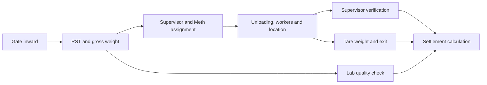

# RiceMillDB database and stored-procedure analysis

Reviewed on 17 September 2026 against the configured live SQL Server database and the current application source.

**Main finding:** the live database, repository SQL scripts, and C# DAL represent different stages of the application. Several normal application operations cannot complete with the current deployed schema/procedure contracts. Establishing one consistent schema and procedure version is the first repair priority.

## Scope and evidence

- Live database: `RiceMillDB` on the configured SQL Express instance.
- Inspected 39 tables, their columns/defaults/indexes, and all 79 procedure definitions. This includes 38 application tables plus `sysdiagrams`, and 72 application procedures plus seven diagram-support procedures.
- Reviewed 20 repository SQL scripts and compared the deployed procedures with DAL/DataLayer calls, controller filters, and settlement calculations.
- Found 58 distinct literal procedure references in DAL/DataLayer; 57 exist in the database. `sp_GetPersonsByType` does not.
- Executed metadata queries, aggregate consistency checks, and three read-only SELECT checks. No business insert/update/delete procedure or schema script was executed. No database data, schema, or application source was changed.
- Transaction tables were empty at inspection. Write-path defects below are established from deployed definitions and application contracts, not by inserting test transactions. No load/concurrency benchmark was performed.

Evidence files:

- [Live columns, indexes, row-count snapshot, and procedure definitions](<F:/Net Core Practice Project/RiceMillProject/analysis/database_metadata.txt>)
- [Live parameter metadata and read-only verification results](<F:/Net Core Practice Project/RiceMillProject/analysis/database_verification.txt>)
- [All 79 procedures, source callers, repository definitions, and snapshot line numbers](<F:/Net Core Practice Project/RiceMillProject/analysis/procedure_inventory.csv>)
- [Reproducible metadata queries](<F:/Net Core Practice Project/RiceMillProject/analysis/read_database_metadata.sql>) and [verification queries](<F:/Net Core Practice Project/RiceMillProject/analysis/verify_database_readonly.sql>)

Snapshot line numbers below refer to `database_metadata.txt`.

## Database structure and intended relationships

These are logical relationships inferred from columns and joins. **The live database has zero foreign keys, zero CHECK constraints, zero triggers, zero views, and zero synonyms.** No trigger synchronizes the duplicated status fields or bridges missing tables.

| Area | Tables | Intended responsibility |
|---|---|---|
| People and login | `P02_Person`, `P11_PersonDesignatation`, `O12_Designatation`, `o_designatationreletation`, `sa05_user`, `sa10_usertype`, `o10_post` | People, post/designation assignments, Meth-worker relationships, login and roles |
| Offices | `o05_office`, `O04_OfficeType`, `O_Officerelation` | Mill/office types and parent-child offices/Dharamkata |
| Locations | `o_OfficeLocation`, `P_PersonLocation`, `m_LocationMaster`, `t_OfficeLocationMapping` | Two parallel location models and person/location access |
| Material and vehicles | `m_ItemCategory`, `m_Item`, `m_BagType`, `m_Vehicle`, `m_VehicleMapping` | Items, categories, bag deductions, vehicles and party/driver assignments |
| Gates and departments | `m_GateMaster`, `m_DepartmentMaster`, `m_InwardTypeMaster`, `m_VehicleTypeMaster`, `m_StatusMaster` | Gate permissions, departments, inward and vehicle categories, statuses |
| Inward/outward | `t_InwardHeader`, `t_GateInwardOutward`, `m_Challan`, `m_ChallanItem`, `t_SerialCounters` | New inward header, older gate register, outward challan lines, serials |
| Weighing/unloading | `t_GateEntry`, `t_GateEntryLocations`, `t_UnloadTransaction`, `t_UnloadLocation`, `t_WorkerAllocation`, `t_LabQualityCheck` | RST, weights, unloading, workers, location and laboratory deductions |
| Security registers | `t_VisitorRegister`, `t_TempMaterialRegister`, `t_SecurityIncident` | Visitors, returnable materials and incidents |

Intended operational flow:

The diagram describes the intended dependencies. The current procedures do not consistently enforce these transitions, and the two inward tables are not connected to the RST creation path.

## Priority 1: current functional blockers

### 1. Gate entry creation and listing do not match the DAL

Deployed `sp_CreateGateEntry` accepts only `@RSTNumber`, `@VehicleId`, `@PartyId`, `@DriverId`, and `@GrossWeight`. The DAL additionally sends `@TargetOfficeId`, which is not a deployed parameter. The procedure also returns no scalar result, although the DAL expects the RST number before inserting target locations.

Deployed `sp_GetAllGateEntries` does not return `TargetOfficeId`, but the reader accesses that column for every row. With no records, the reader loop hides this mismatch; after data exists, listing fails.

Evidence: snapshot lines 624 and 947; [GateEntryDAL.cs](<F:/Net Core Practice Project/RiceMillProject/DAL/GateEntryDAL.cs:38>); verified first-result metadata in the verification file.

Repair direction: deploy a single creation contract that accepts office/inward information, returns the created RST, and saves locations atomically. Make the read projection explicitly match its model.

### 2. Unloading assignment cannot satisfy the live table

`t_UnloadTransaction.LocationId` is NOT NULL and has no default. `sp_AssignUnloading` inserts RST, supervisor, Meth and status without LocationId. The workflow patch makes several bag fields nullable but leaves LocationId mandatory.

Evidence: snapshot table-column section and line 529; `Workflow_Schema_Update.sql`.

Repair direction: decide whether location is selected at assignment or later during unloading. Match schema and procedure to that decision; do not use a fake location ID merely to satisfy the column.

### 3. New inward listing references a nonexistent person table

`sp_ManageGateInwardEntry` SELECT_ALL joins `p1_person` on `p1_personid`. Neither that table nor a compatibility view/synonym exists. The actual person table is `P02_Person`, keyed by `PersonId`.

**Reproduced:** SELECT_ALL returns SQL error 208, `Invalid object name 'p1_person'`.

Evidence: snapshot line 1636; verification `INWARD_SELECT_CHECK`.

### 4. Person registration and worker lookup use a nonexistent designation mapping

The live mapping table is `P11_PersonDesignatation`, with `P02_PersonId` and `O12_DesignationId`. Deployed `sp_SavePersondetails` unconditionally inserts into absent `p1_persondesignatation`; `sp_GetWorkersByMeth` reads the same absent table. Meanwhile, `sp_GetAllPersons` reads `P11_PersonDesignatation`.

**Reproduced:** worker SELECT returns SQL error 208. Registration was not executed because it writes data, but its unconditional reference is incompatible with the live objects.

Evidence: snapshot lines 1019, 1284 and 2021.

Repair direction: use one person-designation mapping consistently. Also ensure registration populates `O12_Designatation.O10_PostId`, which the person listing requires but the deployed registration procedure does not set.

### 5. Login creation has additional parameter-name mismatches

After person registration, `PersonDAL` calls `sp_CreateUserLogin` with `@designatationId` and `@O05_OfficeId`; the deployed parameters are `@DesignationId` and `@OfficeId`. These differences are not just letter case.

Even after fixing the missing mapping table, employee registration would still encounter this contract mismatch. DAL catches and rolls back errors but does not propagate them; a previously assigned person ID can survive rollback in its return value. Controllers redirect without checking whether registration succeeded.

Evidence: snapshot line 744; [PersonDAL.cs](<F:/Net Core Practice Project/RiceMillProject/DAL/PersonDAL.cs:182>).

### 6. Serial-number seed rows are missing

`t_SerialCounters` has zero rows. The required GLOBAL, INWARD, OUTWARD and RST keys are all absent. `sp_GetNextSerialNumber` only updates existing keys; it neither inserts a missing key nor throws when no row is found.

Callers initialize their local serial variables to NULL. With missing keys, generated codes remain NULL. Visitor, incident and temporary-material inserts require non-null codes; older gate inward additionally requires a non-null global serial. Office code columns permit NULL, so an office can instead be inserted without its intended code.

Evidence: verification `COUNTER_SEEDS`; snapshot line 1188 and its callers.

Repair direction: seed missing keys safely after checking existing numbers, and make missing/unknown counter types fail explicitly. The UPDATE within the current transaction serializes an existing counter row; the confirmed defect here is missing-row handling, not a claimed duplicate race for existing rows.

### 7. Location lookup and Meth lookup target missing objects

- `OfficeDAL.GetAllLocations()` reads `t_OfficeLocations`, which does not exist. **Reproduced** SQL error 208 with a TOP(0) read of the same columns.
- `DataLayer.GetAllMeth()` invokes `sp_GetPersonsByType`, absent both live and in repository procedure definitions. Its catch returns an empty dropdown.

Evidence: [OfficeDAL.cs](<F:/Net Core Practice Project/RiceMillProject/DAL/OfficeDAL.cs:51>), [DataLayer.cs](<F:/Net Core Practice Project/RiceMillProject/Models/DataLayer.cs:126>), verification `MISSING_OBJECTS`.

## Priority 2: workflow and calculation correctness

### 8. Status and StatusId can contradict each other

The live RST table has both `Status` and `StatusId`. `sp_CompleteGateExit` and `sp_SaveLabQualityCheck` update text Status only; dashboard counts use StatusId. No trigger synchronizes them. An exited truck can retain StatusId=1 and remain counted as entered/pending unload.

New inward creation inserts StatusId=3 with the comment "Pending", but live status 3 means "Unload Assigned". The alternate setup script assumes a different status dictionary.

Applying `FixDashboardSP.sql` alone would introduce another mismatch: its gate listing returns human labels such as `Gadi In` and `Quality Tested`, whereas controllers compare `Entered` and `Tested`.

Evidence: snapshot lines 548, 1136, 1636 and 2001; verification `STATUS_MASTER`.

Repair direction: agree on machine status codes/IDs and update all writers/readers together. If lab, unloading and gate exit can proceed independently, represent their states separately rather than overwriting one global text state.

### 9. New inward entries do not feed the weighbridge path

The new screen writes `t_InwardHeader`. The weighbridge dropdown procedure reads `t_GateInwardOutward`. RST creation neither accepts/saves InwardNo nor marks `IsRSTGenerated`. Thus the code has two parallel inward systems without the expected handoff or protection against multiple RSTs for one inward.

Evidence: snapshot lines 624, 886 and 1636; GateEntryDAL and GateEntryController.

### 10. Office creation does not populate the type used by office listings

`sp_InsertOffice` accepts `@officetype` and uses it to choose a code prefix, but does not insert it into `o05_office.OfficeType`. Both `sp_GetAllOffices` and `Sp_GetAlloffice` filter OfficeType=1. Live OfficeType is nullable with no default, and one existing office has NULL OfficeType.

New offices can therefore save but disappear from office dropdowns. The legacy office creation script also omits this newer column.

Evidence: snapshot lines 985, 996 and 1441; verification `Offices without OfficeType`.

### 11. Person dropdown calls exclude the requested roles

`PersonDAL.GetAllPersons()` explicitly passes Mode=emp. Deployed `sp_GetAllPersons` limits that mode to post IDs 1–6. Gate entry then filters the returned list for farmers and drivers; Meth unloading filters it for workers. Those non-employee roles are excluded before the C# filters run.

The laboratory dropdown filters for `PersonType == "Employee"`, although the deployed procedure returns PostName as PersonType. A normal `Lab Technician` post does not equal Employee.

The procedure accepts `@officeid` but does not use it. Its unused left join to designation relationships can also multiply rows when multiple matching relationships exist.

Evidence: snapshot line 1019; [PersonDAL.cs](<F:/Net Core Practice Project/RiceMillProject/DAL/PersonDAL.cs:27>); GateEntryController, MethController and LabController.

### 12. Bag deduction has incompatible units and meanings

Deployed legacy `sp_SaveUnloading` divides bags × deduction grams by 1000 before storing the result in `TotalBagDeductionGrams`. Settlement divides that field by 1000 again.

Example: 100 bags × 500 grams = 50,000 grams = 50 kg. Legacy save stores 50 in the grams field; settlement interprets that as 0.05 kg. This is a factor-of-1000 error in that procedure path. Current UnloadTransactionDAL uses the assign/submit/verify path, so this does not establish that current saved data has this error; transaction tables were empty.

The active verification form labels the same field as shortage and suggests zero for perfect bags. That is a different business meaning from standard empty-bag tare.

Evidence: snapshot lines 1257 and 2106; [Verify.cshtml](<F:/Net Core Practice Project/RiceMillProject/Views/Unload/Verify.cshtml>).

Repair direction: distinguish standard bag tare from shortage/other deductions and use one documented storage unit. The settlement BAL currently uses `NetWeight - BagKg - NetWeight * LabPct / 100`; whether lab percentage applies before or after bag deduction needs a business decision, not an assumed code correction.

### 13. Settlement is a recalculated display, not a finalized settlement record

`sp_GetSettlementDetails` sums all unloading deductions without requiring Verified status. It left-joins every lab test for an RST, with no uniqueness constraint or selection of an approved/current test. Repeated tests can return multiple rows; DAL reads only the first, without deterministic ordering.

Missing tare/net weights are mapped to zero by DAL. The bill can therefore show a calculation for an incomplete transaction. There is no dedicated settlement persistence table or finalization procedure among the inspected application objects; the BAL calculates payable weight on demand. Changing source deductions can change a previously printed bill.

Evidence: snapshot line 1257; SettlementDAL, SettlementBAL and SettlementController.

Repair direction: define settlement prerequisites, approved lab version, rounding, and an immutable finalization record if this screen is intended to be the final bill.

### 14. Outward approval can repeat and only copies one challan line

`sp_ApproveOutwardChallan` selects TOP 1 challan item without ordering and records just that item. Multi-item challans lose detail in the outward register. Approval does not require a pending status, prevent an already-approved challan from being approved again, or wrap the business insert and status update in one transaction.

Evidence: snapshot line 479. No transaction records existed to assess historical impact.

Repair direction: atomically transition pending challans, retain all detail lines, and make repeat approval return the existing result or a clear rejection.

### 15. Multi-step unloading is not atomic or protected from replay

MethController submits unloading, inserts location, then saves each worker using separate DAL calls/connections. A failure can leave the unload marked complete with missing workers/location. Re-submission can append duplicate worker allocations and inflate palledari totals. Submit/verify procedures check only ID, not the prior workflow state.

Gate entry plus target locations and office plus locations have similar partial-save risks. Person registration already has a caller transaction, but its error reporting needs repair as described above.

Evidence: snapshot lines 1553, 2130, 2143 and 2367; [MethController.cs](<F:/Net Core Practice Project/RiceMillProject/Controllers/MethController.cs:57>).

### 16. Location master and office mapping have inconsistent semantics

Unloading/person locations use `o_OfficeLocation`; the new management screens use `m_LocationMaster` and `t_OfficeLocationMapping`. IDs are independent. The new mapping's OfficeId actually joins `o10_post.PostId`, and its controller deliberately populates the office dropdown from posts. It therefore maps a job post to a location while calling it an office mapping.

Evidence: snapshot lines 1203, 1236 and 1839; [OfficeLocationMappingController.cs](<F:/Net Core Practice Project/RiceMillProject/Controllers/OfficeLocationMappingController.cs:53>).

Repair direction: decide whether this is role access or physical office mapping. Rename it for role access, or move it consistently to OfficeId from `o05_office`. Consolidate location identity before adding FKs; do not equate unrelated integer IDs.

## Integrity, authentication, and maintainability

### 17. Database relationships and business ranges are not enforced

The live FK and CHECK inventories are empty. References to nonexistent people, RSTs, items, locations and users are therefore not rejected by relational constraints. There are no database checks for negative weights, tare exceeding gross, negative bags/charges, or percentage ranges.

`P11_PersonDesignatation` and `t_GateEntryLocations` have no primary key/index in this snapshot. Common duplicate protections are absent for usernames, vehicle numbers, worker allocations and lab records per RST. Which lab/allocation combinations should be unique depends on whether retests, multiple shifts or repeat unloading are valid business events.

Aggregate checks found no duplicate usernames or vehicle numbers and no orphans in the sampled login/P11 relationships. That is not a full integrity certification: only one person/user existed, and transaction tables were empty.

### 18. Authentication compares raw password values and role sources can diverge

Deployed `sp_ValidateUser` compares PasswordHash directly with the supplied password. `sp_CreateUserLogin` writes a fixed default password literal into that column. The inspected application path does not perform password hashing/verification.

The login procedure returns `P02_Person.PersonType` as Role. Registration permits numeric post strings, while controller authorization expects names such as Admin and Gate Man. The existing user has matching role text, so this mismatch is a risk for newly registered users, not a reproduced failure for the current login.

Post insert/update procedures do not maintain `sa10_usertype`, although login creation assumes matching post/user-type IDs. User-type IsActive is also not checked in validation.

Evidence: snapshot lines 744, 1513, 2253 and 2343; UserDAL and AccountController.

Repair direction: implement password hashing in the application authentication layer and derive role claims from a consistent active role mapping. Keep post and user-type changes coordinated.

### 19. Number generation and audit behavior need tightening

`sp_ManageGateInwardEntry` and `sp_ManageLocationMaster` generate codes using MAX(identity)+1 before inserting. Concurrent requests can choose the same code; unique constraints reject one request rather than resolving the race. Location codes keep only three digits, so suffixes eventually repeat. C# RST generation uses second-resolution timestamps and can also collide.

New inward DAL hardcodes CreatedBy=1. Location procedures default CreatedBy=1 and their DAL omits the actual user. Audit attribution therefore does not identify the real operator.

`sp_ReturnTempMaterial` generates/returns an outward number even if its status-guarded UPDATE affects no row. This can appear successful for an unknown/already-returned entry. Visitor exit has a useful active-state guard, but the caller does not report zero-row outcomes.

Evidence: snapshot lines 1636, 1769 and 1979; GateInwardDAL line 135; GateEntryBAL.

### 20. Fresh deployment is not reproducible from the current scripts

Twelve application procedures exist live without repository CREATE/ALTER definitions: `Sp_GetAllDhermKataorLocations`, `Sp_GetAlloffice`, `sp_GetAllOffices`, `Sp_GetAllPersonFordublicacyMobileNumber`, `sp_GetAllPersons`, `Sp_GetemployeePost`, `Sp_GetMeth`, `Sp_GetPost`, `sp_InsertPerson`, `Sp_InsertRelationBetweenOffice`, `sp_UpdateOffice`, `sp_UpdatePerson`.

Multiple files redefine key procedures with different parameter lists or result shapes: gate creation, gate listing, user validation, user creation, person registration, unloading, dashboard and office-location mapping. Applying an older file can overwrite a compatible procedure. The deployed gate procedures currently match the older transaction version rather than the later workflow patch.

`DatabaseSchema.sql` drops all existing foreign keys and many tables. `TruncateAndSeedAdmin.sql` deletes registration data and reseeds identities. `ApplyForeignKeys.sql` deletes some orphan rows before adding constraints and refers to the absent mapping table. These are not safe general-purpose repair migrations for the current database.

`SQL_Gateman_Workflow_Setup.sql` also attempts explicit identity StatusId inserts without IDENTITY_INSERT in its create-if-absent branch; when the existing status table is present, that branch is skipped and the incompatible status meanings remain instead.

Repair direction: capture the authoritative live/custom objects, then maintain ordered incremental migrations and one definitive procedure definition per object. Preserve data during migration and validate on a disposable database copy.

## Procedure-family review summary

| Procedure family | Assessment |
|---|---|
| Bag type, item category, vehicle, post CRUD | Simple parameterized statements broadly match their direct DAL callers. Need agreed uniqueness/range rules; post CRUD does not synchronize user types. |
| Item CRUD | DAL and procedure parameters align for current model. Unit exists in the table but is not exposed by these procedures, which leave its default in effect. |
| Office and office hierarchy | OfficeType omission makes inserted offices invisible to filtered reads; some live hierarchy/read procedures are missing from repository scripts. |
| Person save/read/login/Meth lookup | Missing mapping/procedure objects, parameter differences, incompatible role filtering and incomplete designation population. |
| RST creation/list/exit | Creation and read contracts mismatch; exit updates only text state and lacks weight/prerequisite checks. |
| Assignment/submit/verify | Required location blocks assignment; writes are independent and transitions are not guarded. |
| Worker/location inserts | Simple inserts accept duplicates/orphans without database constraints; need to participate in parent workflow transaction. |
| Lab and settlement | No approved-test selection, duplicate-test protection, verified-only aggregation or persisted settlement; legacy deduction units differ. |
| Serial/gate inward/outward | Missing serial seed rows; separate inward models; broken new inward join; repeat/partial outward approvals possible. |
| Gate/department master CRUD | Active filters and soft deletes are present; no relational constraints to enforce referenced departments/offices/people. |
| Location/master mapping | Concurrent auto-code collision risk, independent location identities and role-versus-office ambiguity. |
| Visitor/material/incident registers | Code generation currently depends on missing GLOBAL seed; read joins and audit attribution need consistent integrity; material return can report a no-op as success. |
| Dashboard | Reads StatusId while main transaction writers change text Status. |
| Seven diagram procedures | SQL Server diagram support, not part of rice-mill business workflow. |

## Repair order and validation plan

1. Capture the current authoritative schema and settle canonical names: person-designation mapping, physical offices versus posts, location identity, inward table and workflow states.
2. Fix missing objects/contracts without creating redundant compatibility tables: gate procedure parameters/results, person save/login parameters, Meth lookup and location queries.
3. Reconcile serial seeds and make missing counters explicit errors. Populate OfficeType consistently and correct role-based dropdown queries.
4. Connect inward to RST and implement valid, atomic workflow transitions with a clear retry policy.
5. Confirm bag/shortage units, lab deduction basis, lab approval/retest policy and final settlement behavior with the mill's business rules.
6. Audit existing relationships, then introduce primary/foreign keys, appropriate unique constraints and business CHECK constraints through non-destructive migrations.
7. Fix authentication and audit attribution; preserve structured database errors instead of converting every failure into an empty list or silent success.
8. Validate on a disposable database: employee/party/driver/worker registration; new inward to one RST; assignment before/after location selection; repeat submission; lab retest; exit validation; final settlement; multi-item outward/repeat approval; missing counter; concurrent inward/location creation.

After correctness is established, evaluate indexes for RST joins in unload/lab tables, worker allocations by UnloadId, and dashboard date/status filters. The snapshot contains primary/unique indexes but no separate non-unique secondary indexes. Empty transaction tables provide no evidence for a measured performance bottleneck or a justified load-specific index design.

**Analysis outcome:** the architecture covers the intended mill workflow, but the deployed database needs contract and schema reconciliation before the end-to-end workflow can be considered verified. This report documents the findings; it does not claim the defects are repaired.
